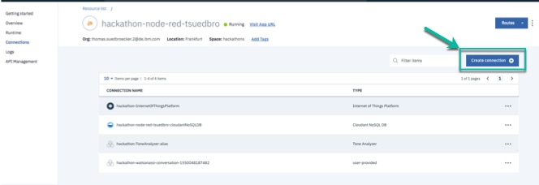

# Hackathons and Node-RED

In this github I will backup some Node-RED flows, which can be useful in Hackathons.
Also I provide the basic guide, how to setup these flows?

# Cross-origin resource sharing

The project also contains the applications [simple forward server](simple_forward_server/readme.md) and [simple web app](simple_web_app/readme.md).

When you use Node-RED on IBM Cloud during hackathons you will notice REST calls in flows cannot directly be invoked from a web-application. The reason for this is mostly that cors (cross-origin resource sharing) is not enabled for the Node-RED server. This blog post is about using a simple workaround to address the given cors (cross-origin resource sharing) problem.

# Watson Assistant and custom output

You can use the  [Watson Assistant](node-red-flows/node-flow-starting-point-watson-assistant.json) to follow the steps in the following video.

## Setup

1. Setup Watson Assistant Starter Kit

_Note:_ You can import this [customized skill](node-red-flows/node-flow-starting-point-watson-assistant.json) with the temperature intent to your Watson Assistant instance.

2. Setup Node-RED Starter Kit

Inside Node-RED I use the additional _Nodes_ from [Node-RED Dashboard](https://flows.nodered.org/node/node-red-dashboard).

You have to add the **Node-RED Dashboard** before you import my customized flow.

3. Select **manage palatte** from the menu on right upper side of the page.

4. Now choose the tab **install** and search for **Node-RED Dashboard** press install.

To take advantage from the VCAP variable and the easy usage of service in IBM Cloud, you should bind the service to your Node-RED instance.

5. Open your **Node-RED Application** in IBM Cloud.

6. Press create connection. The you can select you Watson Assistant service

7. Restage the application.

Now you can do the same steps I did in the video.

