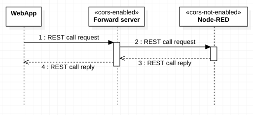

# Simple web app

In case of that a cors problem using **Node-RED** as **REST server** can not be fixed. I wrote a simple sample **WebApp** to access **REST forward server**, which has **cors enabled**.

```javascript
var cors = require("cors"); // Cors
app.use(cors());
```

Related blog post:[cors and Node-RED using a simple forwarding server](https://suedbroecker.net/2019/03/13/cors-and-node-red-using-a-simple-forward-server/)

_Note:_ Static sample web page uses as a starting point code from [stackoverfollow](https://stackoverflow.com/questions/49085931/how-to-call-existing-rest-api-from-a-html-form).

## Basic flow




## Local installation

```sh
git clone https://github.com/thomassuedbroecker/hackathons_and_node-red.git
cd /hackathons_and_node-red/simple_web_app
```

```sh
npm install
```

```sh
npm start
```

## Usage

```sh
npm start

> @ start /hackathons_and_node-red/simple_web_app
> node server.js

Listening on port (3001)
```

Open http://localhost:3001 in the browser and insert some text in the edit box.

You should the you response like this:

* **WebApp webpage output**


* **Forward server console output**


* **Node-RED output**


